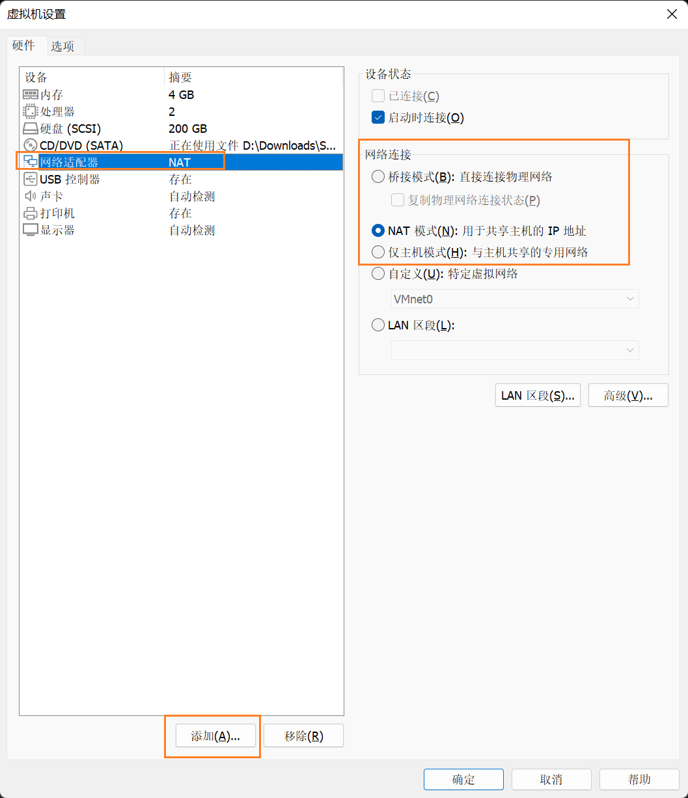
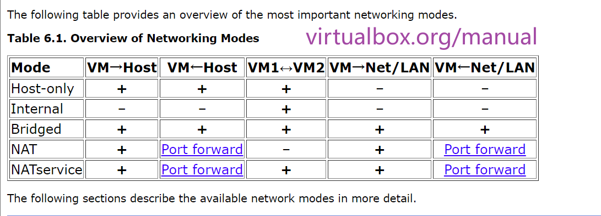
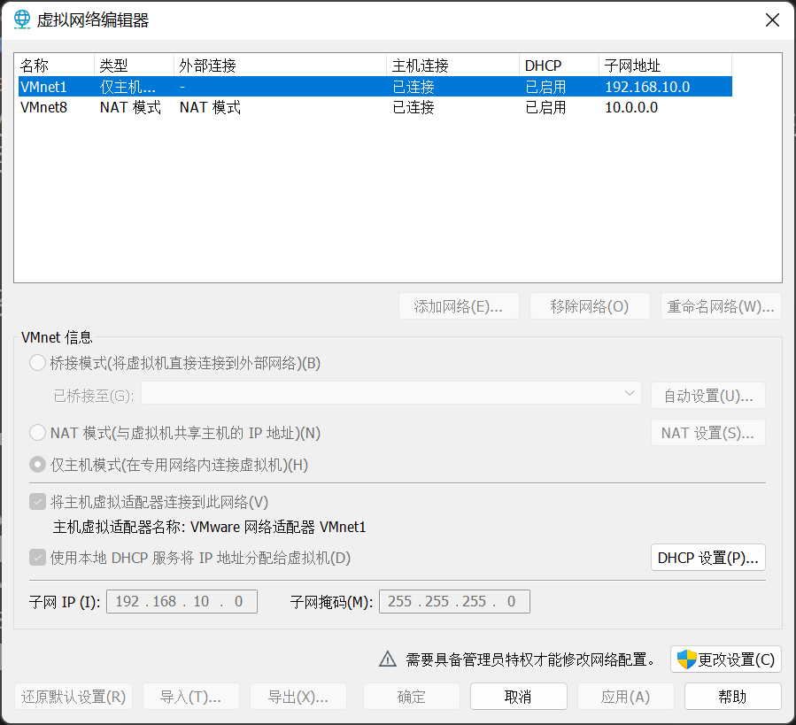
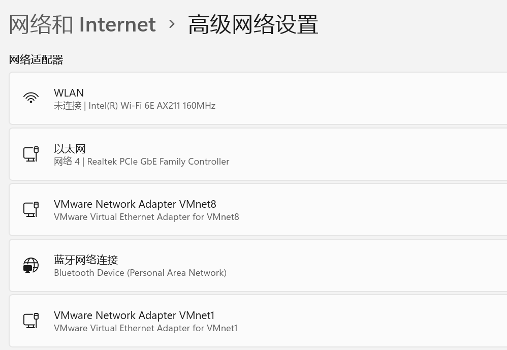
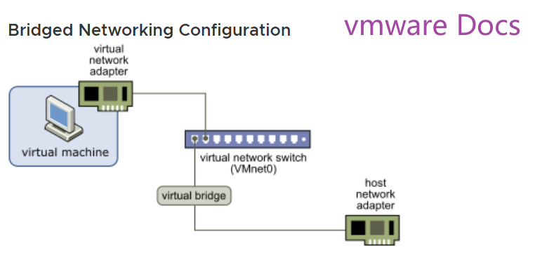
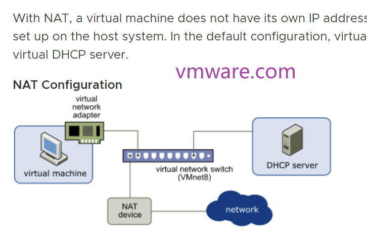
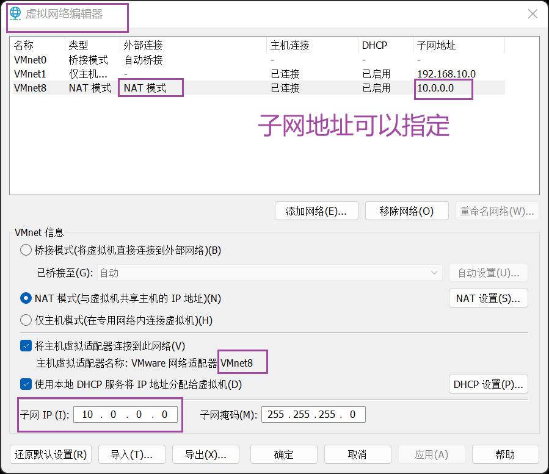
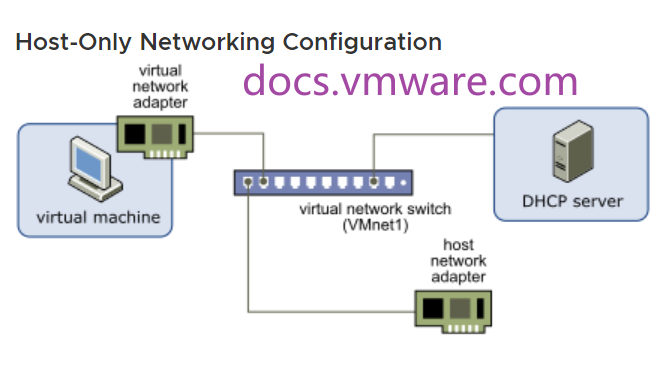

# VMware 中的三种网路连接模式  
> [Understanding Virtual Networking Components](https://docs.vmware.com/en/VMware-Workstation-Pro/16.0/com.vmware.ws.using.doc/GUID-8FDE7881-C31F-487F-BEF3-B2107A21D0CE.html)  
> [What is the difference between NAT / Bridged / Host-Only networking?](https://superuser.com/questions/227505/what-is-the-difference-between-nat-bridged-host-only-networking)  
> [VMware Virtual Networking Concepts](https://www.vmware.com/content/dam/digitalmarketing/vmware/en/pdf/techpaper/virtual_networking_concepts.pdf)  
> [理解 VMware 网络模式：桥接、仅主机和 NAT](https://www.junmajinlong.com/virtual/network/vmware_net/)  
> [Vmware—桥接、NAT以及仅主机模式的详细介绍和区别](https://zhuanlan.zhihu.com/p/532535216)  
> [Chapter 6. Virtual Networking](https://www.virtualbox.org/manual/ch06.html#network_bridged)  
  
  
  
  
  
- 几种网络模型比较  
> [6.2. Introduction to Networking Modes](https://www.virtualbox.org/manual/ch06.html#network_bridged)  
> $nbsp;  
>   
  
  
- `+` 表示 `yes`，`-` 表示 `no`  
- ENSB   
- 开机状态添加网卡  
  
## VMware 中三种虚拟交换机  
vmware 三种网络模型对应的三种虚拟交换机  
  
| Network Type | Switch Name |
| :----------: | :---------: |
|   Bridged    |   VMnet0    |
|     NAT      |   VMnet8    |
|  Host-only   |   VMnet1    |
  
  
  
  
  
| 模式            | 网段                   | 局域网其他机器能否直接访问虚拟机 | 外网访问         | 核心                     |
| --------------- | ---------------------- | -------------------------------- | ---------------- | ------------------------ |
| 桥接Bridged     | 和宿主机物理网卡同网段 | ✅可以                            | ✅直接上网        | 虚拟机=局域网独立设备    |
| NAT             | 独立私有网段（vmnet8） | ❌不能，需要端口转发              | ✅通过NAT网关上网 | 虚拟机可上外网，对外隐藏 |
| 仅主机Host-Only | 独立私有网段（vmnet1） | ❌不能                            | ❌默认不能上外网  | 宿主机+虚拟机私有内网    |

## 桥接模式（Bridged）  
> [Configuring Bridged Networking](https://docs.vmware.com/en/VMware-Workstation-Pro/17/com.vmware.ws.using.doc/GUID-BAFA66C3-81F0-4FCA-84C4-D9F7D258A60A.html)  
> &nbsp;  
>   
  
VMware 虚拟交换机，把虚拟机的虚拟网卡**直接桥接到宿主机物理网卡**。
相当于：虚拟机和物理宿主机，**插在同一个真实局域网交换机上**。
  
- 默认模式，虚拟网络交换机为 VMnet0  
- DHCP 服务会自动识别 VM 并分配一个和**物理主机在同一个子网的 IP 地址**  
- 可以和外部网络联通，相当于在当前物理机所在的子网增加一台计算机  
- 虚拟机占用物理机局域网中的一个 IP，可以和局域网中其他主机互相访问  
- 虚拟机连接到虚拟交换机（VMnet0），虚拟交换机通过虚拟网桥和物理主机相连  
  
### 网段
虚拟机IP 和 物理宿主机**同网段**，由局域网真实路由器DHCP分配IP。
例：宿主机IP `192.168.1.100`，虚拟机拿到 `192.168.1.105`

### 通信能力
1. ✅ 虚拟机 ↔ 宿主机：互通
2. ✅ 虚拟机 ↔ 局域网内其他电脑/设备：互通
3. ✅ 虚拟机 ↔ 互联网：直接访问
4. ✅ 局域网其他机器**可以直接访问虚拟机IP**，不需要端口映射

### 特点
- 虚拟机在局域网里是一台**独立的设备**，有独立MAC地址
- 需要局域网路由器有空闲IP
- 缺点：如果宿主机换网络（从家里wifi切到公司wifi），虚拟机网段跟着变

## NAT  
> [Configuring Network Address Translation](https://docs.vmware.com/en/VMware-Workstation-Pro/17/com.vmware.ws.using.doc/GUID-89311E3D-CCA9-4ECC-AF5C-C52BE6A89A95.html)  
> &nbsp;  
>   
  
VMware 在宿主机内部虚拟出一个独立虚拟子网，内置虚拟DHCP服务器 + NAT网关。
虚拟机网卡接入VM虚拟交换机，数据包交给VM内置NAT网关做地址转换。

- NAT 是网络地址转换（network address translation），虚拟网络交换机为 VMnet8  
  
- 虚拟机安装时有个网卡，选择 NAT 模式，该网卡可以指定一个子网地址和子网掩码  
  
  
  
- 虚拟网络交换机（VMnet8）和 NAT 设备连接，通过 NAT 设备和外部互联网通信  
  
- NAT 模式的虚拟机没有对外的 IP 地址，虚拟机和外部通信时 NAT 设备将   
虚拟机的内部 IP 地址处理后转换为物理主机的 IP 地址和外部通信  
  
- 一个主机上只允许一个 NAT 模式的虚拟网络，因此不能添加多个 NAT 模式的网卡但设置不同的子网；主机上多个 NAT 模式网卡的虚拟机在同一个子网，可以互相访问  
  
- 外部网络不能直接和虚拟机通信，但可以通过端口转发实现通信  

### 网段
**独立私有网段，不和宿主机同网段**。
宿主机VMware虚拟网卡（`vmnet8`）是这个子网的网关。
示例：
宿主机物理网卡：`192.168.1.100`
vmnet8：`192.168.130.2`
虚拟机IP：`192.168.130.10`

### 通信能力
1. ✅ 虚拟机 → 宿主机、外网：可以主动访问（NAT源地址转换）
2. ✅ 虚拟机 ↔ 同NAT网段其他虚拟机互通
3. ❌ **外部局域网其他机器不能直接访问虚拟机**
> 如果外部机器要访问虚拟机，需要在VMware里配置**端口转发**（端口映射）

### 特点
- 虚拟机网段独立，不受物理局域网影响，宿主机换wifi不影响虚拟机IP
- 不需要占用物理局域网IP
- 访问外网靠NAT转换，性能有轻微损耗

## 仅主机（host-only）  
> [Configuring Host-Only Networking](https://docs.vmware.com/en/VMware-Workstation-Pro/17/com.vmware.ws.using.doc/GUID-93BDF7F1-D2E4-42CE-80EA-4E305337D2FC.html)  
> &nbsp;  
>   
  
- 虚拟网络交换机为 VMnet1  
- 虚拟机和物理主机都连在虚拟网络交换机（VMnet1）上，因此能和物理主机通信  
- 虚拟机用的是专用网络地址，因此和外部无法通信，仅对主机可见  
- 构建一个孤立的网络环境，即虚拟机仅能和物理主机通信，不能和外部网络通信  
- 一台主机可以创建多个 host-only 模式的虚拟网络，设置在不同的子网中  

只创建**宿主机和虚拟机之间的私有虚拟网络**，没有NAT网关，**不能直接访问外网**。
所有虚拟机和宿主机的vmnet1网卡，接入同一个虚拟交换机。

### 网段
独立私有网段，比如 `192.168.124.0/24`，由VM内置DHCP分配。

### 通信能力
✅ 虚拟机 ↔ 宿主机互通
✅ 同HostOnly网段虚拟机之间互通
❌ 默认**无法访问互联网**

### 使用场景
纯内网测试环境，隔离，不想让虚拟机访问外网。

# 虚拟机镜像
虚拟机在**启动并进入系统后**，就不再需要那个ISO镜像文件了。删除镜像后不影响之后使用。

可以把整个过程想象成用U盘给一台新电脑装系统：

1.  **安装阶段**：新建虚拟机并挂载Ubuntu的ISO文件，就像把制作好的系统U盘插入新电脑。你启动虚拟机，它从这张“虚拟光驱”启动，开始安装系统。
2.  **运行阶段**：当Ubuntu系统安装完毕，所有必要的系统文件都已经复制并安装到了虚拟机的**虚拟硬盘（.vmdk文件）** 里。此时，虚拟机就像一台已经装好系统的电脑，可以直接从自己的硬盘启动和运行，不再需要之前的“安装U盘”（即ISO镜像）了。

因此，即使删除了ISO文件，或者在VMware设置里移除了镜像路径，对于已经安装好并正在运行的虚拟机来说，没有任何影响，它依然可以从自己的虚拟硬盘正常启动。

VMware设置里CD/DVD显示的路径，仅仅是**一个指向ISO文件的记录**。这个记录存在，VMware就会在启动时尝试去读取那个文件。如果文件不存在，虚拟机可能就会报错找不到启动设备（尤其是在BIOS设置里光驱优先级高于硬盘时）。
  - 如果**不再需要**通过光盘引导，最干脆的方法是：在虚拟机**完全关闭**的状态下，编辑设置，在CD/DVD设备的**设备状态**里，直接取消勾选“**启动时连接**”。这样虚拟机就会忽略这个设备，直接从硬盘启动。
  - 如果你**未来还需要**用它来安装软件或系统，那么正确的做法是**保持一个有效的ISO文件路径**，并仅在需要时才勾选“启动时连接”。

# 虚拟机和 windows 直接复制粘贴

1.  **确认VMware设置**：
    *   完全关闭Ubuntu虚拟机（关机，不仅仅是休眠）。
    *   在VMware中，选中该虚拟机，进入 **虚拟机设置** > **选项** 选项卡 > **客户机隔离** 。
    *   确保 **启用复制粘贴** 和 **启用拖放** 选项已被勾选。如果未勾选，请勾选后重新启动虚拟机尝试。

2.  **确认VMware Tools状态**：
    *   在Ubuntu中，打开终端。
    *   运行命令 `vmware-toolbox-cmd -v` 来检查VMware Tools的版本信息。如果该命令无法执行或报错，通常意味着VMware Tools没有正确安装。
    *   对于较新的Ubuntu版本，官方推荐安装开源版本的 `open-vm-tools`。您可以通过以下命令安装或更新：
        ```bash
        sudo apt-get update
        sudo apt-get install open-vm-tools open-vm-tools-desktop
        ```
    *   安装完成后，**务必重启虚拟机**：
        ```bash
        sudo reboot
        ```

**Ubuntu端检查与配置**

1.  **检查服务状态**：
    *   安装 `open-vm-tools` 后，其对应的服务 `vmtoolsd` 应该会自动运行。您可以通过以下命令检查：
        ```bash
        sudo systemctl status open-vm-tools
        ```
    *   如果服务没有运行，使用以下命令启动并设置开机自启：
        ```bash
        sudo systemctl start open-vm-tools
        sudo systemctl enable open-vm-tools
        ```

2.  **手动启动VMware User进程**：
    *   有时，`vmware-user` 这个用户级别的进程可能没有正确启动。可以在终端中手动启动它：
        ```bash
        /usr/bin/vmware-user
        ```
    *   为了确保每次登录时都能自动运行，可以将其添加到Ubuntu的 **启动应用程序** 中。