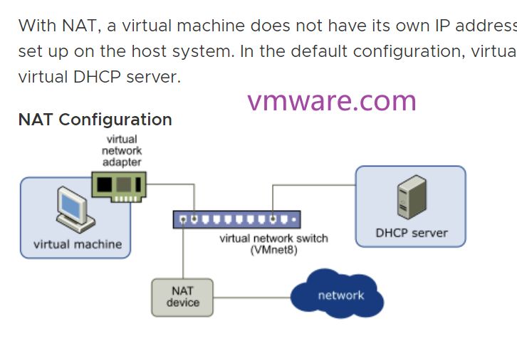

# VMware 中的三种网路连接模式  
> [Understanding Virtual Networking Components](https://docs.vmware.com/en/VMware-Workstation-Pro/16.0/com.vmware.ws.using.doc/GUID-8FDE7881-C31F-487F-BEF3-B2107A21D0CE.html)  
> [What is the difference between NAT / Bridged / Host-Only networking?](https://superuser.com/questions/227505/what-is-the-difference-between-nat-bridged-host-only-networking)  
> [VMware Virtual Networking Concepts](https://www.vmware.com/content/dam/digitalmarketing/vmware/en/pdf/techpaper/virtual_networking_concepts.pdf)  
> [理解 VMware 网络模式：桥接、仅主机和 NAT](https://www.junmajinlong.com/virtual/network/vmware_net/)  
> [Vmware—桥接、NAT以及仅主机模式的详细介绍和区别](https://zhuanlan.zhihu.com/p/532535216)  
> [Chapter 6. Virtual Networking](https://www.virtualbox.org/manual/ch06.html#network_bridged)  
  
  
  
  
  
- 几种网络模型比较  
> [6.2. Introduction to Networking Modes](https://www.virtualbox.org/manual/ch06.html#network_bridged)  
> $nbsp;  
>   
  
  
- `+` 表示 `yes`，`-` 表示 `no`  
- ENSB   
- 开机状态添加网卡  
  
## VMware 中三种虚拟交换机  
vmware 三种网络模型对应的三种虚拟交换机  
  
|Network Type|Switch Name|  
|:--:|:--:|  
|Bridged|VMnet0|  
|NAT|VMnet8|  
|Host-only|VMnet1|  
  
  
  
  
  
  
## 桥接模式（Bridged）  
> [Configuring Bridged Networking](https://docs.vmware.com/en/VMware-Workstation-Pro/17/com.vmware.ws.using.doc/GUID-BAFA66C3-81F0-4FCA-84C4-D9F7D258A60A.html)  
> &nbsp;  
>   
  
  
- 默认模式，虚拟网络交换机为 VMnet0  
- DHCP 服务会自动识别 VM 并分配一个和**物理主机在同一个子网的 IP 地址**  
- 可以和外部网络联通，相当于在当前物理机所在的子网增加一台计算机  
- 虚拟机占用物理机局域网中的一个 IP，可以和局域网中其他主机互相访问  
- 虚拟机连接到虚拟交换机（VMnet0），虚拟交换机通过虚拟网桥和物理主机相连  
  
## NAT  
> [Configuring Network Address Translation](https://docs.vmware.com/en/VMware-Workstation-Pro/17/com.vmware.ws.using.doc/GUID-89311E3D-CCA9-4ECC-AF5C-C52BE6A89A95.html)  
> &nbsp;  
>   
  
- NAT 是网络地址转换（network address translation），虚拟网络交换机为 VMnet8  
  
- 虚拟机安装时有个网卡，选择 NAT 模式，该网卡可以指定一个子网地址和子网掩码  
  
  
  
- 虚拟网络交换机（VMnet8）和 NAT 设备连接，通过 NAT 设备和外部互联网通信  
  
- NAT 模式的虚拟机没有对外的 IP 地址，虚拟机和外部通信时 NAT 设备将   
虚拟机的内部 IP 地址处理后转换为物理主机的 IP 地址和外部通信  
  
- 一个主机上只允许一个 NAT 模式的虚拟网络，因此不能添加多个 NAT 模式的网卡但设置不同的子网；主机上多个 NAT 模式网卡的虚拟机在同一个子网，可以互相访问  
  
- 外部网络不能直接和虚拟机通信，但可以通过端口转发实现通信  
  
## 仅主机（host-only）  
> [Configuring Host-Only Networking](https://docs.vmware.com/en/VMware-Workstation-Pro/17/com.vmware.ws.using.doc/GUID-93BDF7F1-D2E4-42CE-80EA-4E305337D2FC.html)  
> &nbsp;  
>   
  
- 虚拟网络交换机为 VMnet1  
- 虚拟机和物理主机都连在虚拟网络交换机（VMnet1）上，因此能和物理主机通信  
- 虚拟机用的是专用网络地址，因此和外部无法通信，仅对主机可见  
- 构建一个孤立的网络环境，即虚拟机仅能和物理主机通信，不能和外部网络通信  
- 一台主机可以创建多个 host-only 模式的虚拟网络，设置在不同的子网中  
